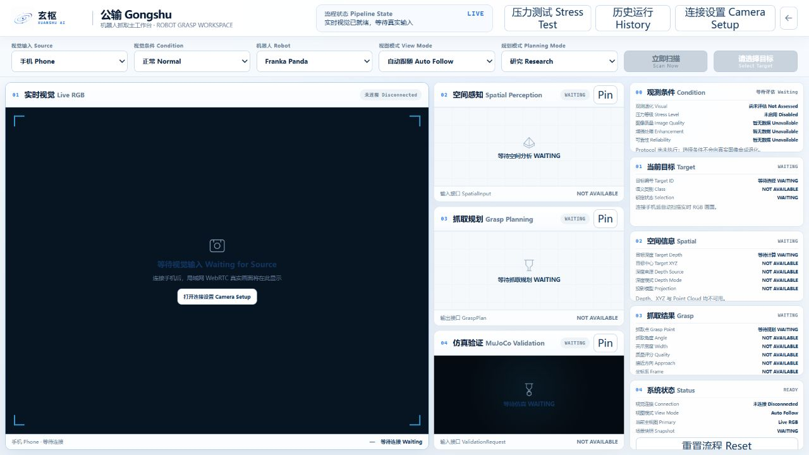

# Gongshu / 公输

<p align="center">
  <strong>Modular Robot Intelligence and Grasping Experimentation Platform</strong>
</p>

<p align="center">
  <a href="README.md">简体中文</a> ·
  <a href="README_EN.md">English</a> ·
  <a href="README_JA.md">日本語</a> ·
  <a href="README_KO.md">한국어</a>
</p>

<p align="center">
  <a href="https://github.com/PowellWells/gongshu/tree/v0.1.0"></a>
  <a href="#roadmap"></a>
  <a href="pyproject.toml"></a>
  <a href="#requirements"></a>
  <a href="tests"></a>
  <a href="https://github.com/PowellWells/gongshu/stargazers"></a>
  <a href="https://github.com/PowellWells/gongshu/issues"></a>
  <a href="LICENSE"></a>
</p>

Gongshu 是一个开源、模块化的机器人智能平台，统一承载视觉输入、空间理解、抓取规划、仿真验证、实验体系与智能决策。Experiment Lab 负责实验组织与分析；Xiezhi（獬豸）是 Gongshu 内部的智能算法与决策能力，不是独立产品。

当前产品架构以 [XUANSHU AI Architecture Freeze v3.0](XUANSHU_ARCHITECTURE_FREEZE_V3.0.md) 为准。


> 项目概念宣传图 Concept Cover。v0.1.0 的实际能力边界以本文说明为准。

## Overview

Gongshu 帮助研究者在同一工作台中组织机器人视觉、抓取与智能决策实验，并查看从输入到仿真验证的中间结果。当前平台包含五类能力：

- **RGB / RGB-D 视觉输入**：支持手机摄像头 RGB 输入，以及仿真或兼容数据源提供的 RGB-D 数据接口。
- **空间理解**：处理深度、点云、目标 XYZ 与相机内参等空间信息。
- **抓取规划**：生成、检查和排序抓取候选，便于比较规划结果。
- **仿真验证**：使用 MuJoCo / robosuite 和 Franka Panda 对抓取过程进行实验验证。
- **实验与智能决策**：Experiment Lab 组织 Trial、评价与比较；内部 Xiezhi 模块提供算法决策、风险评估与策略演进。

v0.1.0 是 Gongshu 的开源基线。真实视觉输入目前由同一可信局域网内的手机摄像头提供；真实 RGB-D 相机接入仍是后续方向。当前版本不包含经过验证的真实机器人端到端抓取，也不将单目深度或仿真结果表述为真实硬件测量。

## Demo

### Gongshu v0.1.0 概览

<video src="https://github.com/user-attachments/assets/12a7abca-c202-45ff-b3dd-485dfb8e599a" controls width="100%">
</video>

演示视频展示 Gongshu v0.1.0 的视觉输入、目标感知、空间理解、抓取规划与 MuJoCo 仿真验证体验。

视频文件也保存在 GitHub Release Assets 中：[下载 Gongshu v0.1.0 演示视频](https://github.com/PowellWells/gongshu/releases/download/v0.1.0/gongshu-v0.1.0-demo.mp4)。

## Quick Start —— 5 分钟运行 Gongshu

### Requirements

- Windows 11（当前验证平台）
- Python 3.12.x（`>=3.12,<3.13`）
- Phone Camera 功能需要手机与 PC 位于同一可信私有局域网
- CUDA 为可选项；无可用 GPU 时保留 CPU fallback

### Installation

```powershell
git clone https://github.com/PowellWells/gongshu.git
cd gongshu
py -3.12 -m venv .venv
.\.venv\Scripts\python.exe -m pip install --upgrade pip
.\.venv\Scripts\python.exe -m pip install -e .
```

`pyproject.toml` 是项目依赖的权威来源。也可通过 `requirements.txt` 使用常规环境安装入口：

```powershell
.\.venv\Scripts\python.exe -m pip install -r requirements.txt
```

模型权重不随 Git 源码仓库发布。FastSAM、Depth Anything V2 与 GR-ConvNet 会按项目既有的模型解析规则查找本地 Release Bundle、`artifacts/models/`、用户缓存或官方来源；具体来源和许可证边界见 [THIRD_PARTY_NOTICES.md](THIRD_PARTY_NOTICES.md)。

### Launch

XUANSHU AI 平台唯一官方启动入口：

```text
G:\Vision2Grasp\Start-XUANSHU-LAB.cmd
```

双击该文件进入 XUANSHU AI Launcher，再打开 Gongshu。Phone Camera、Local Image、MuJoCo、Experiment Lab 以及 Xiezhi 智能算法与决策能力均由 Gongshu 内部统一加载；用户不单独启动 Xiezhi。不要从子目录、开发分支或 Git 工作树单独启动模块。首次连接手机时，在 Gongshu 中打开 **连接设置 Camera Setup**，按本地 CA 与 Pairing 二维码引导完成连接。

<details>
<summary>Repository layout</summary>

```text
gongshu/
├── assets/                     GitHub README 展示素材
├── configs/                    默认实验配置
├── contracts/                  运行结果数据契约
├── frontend/                   Gongshu 与 XUANSHU LAB 前端
├── scripts/                    启动、基准与发布脚本
├── src/vision2grasp/           感知、空间、抓取、控制与仿真模块
├── src/xuanshu_lab/            桌面研究平台运行层
├── tests/                      单元测试与集成测试
├── requirements.txt            环境安装依赖
├── VERSION.md                  发布版本信息
└── run_vision2grasp_app.py     Gongshu 本地服务入口
```

运行时生成的模型、证书、相机 Session、用户数据、实验输出和日志位于被 Git 忽略的本地目录，不随源码发布。

</details>

## Features

### Visual Perception

接收 RGB / RGB-D 数据，提供目标区域、Mask、Bounding Box Overlay、目标锁定与轻量跟踪。

### Spatial Understanding

在同一 Scene Snapshot 上查看深度、点云、目标 XYZ 与相机内参状态。

### Grasp Planning

提供 GR-ConvNet 抓取图、Top-K 抓取候选、可执行性检查与候选排名。

### Simulation Validation

使用 MuJoCo / robosuite 和 Franka Panda 进行连续动力学仿真，并支持会话内 Recording 与 Replay。

### Experiment Workspace

四视图工作台集中展示视觉、空间、抓取与仿真结果，并支持 Normal、Blur、Low-Light 等实验条件。

### Modular Extension

模块化接口便于后续接入兼容的数据源、研究模块与抓取算法，同时保持核心平台边界清晰。

## System Preview / Screenshots



上图为 Gongshu 桌面研究工作区启动状态。相机接入后，Live RGB 显示实时画面、目标区域与锁定状态，其余视图沿同一目标快照更新。

## Roadmap

- [x] **v0.1 Open-source baseline**：建立 Apache-2.0 许可、开源范围、治理基线与现有实验工作台。
- [ ] **RGB-D 相机接入**：作为后续扩展方向，具体设备与时间表尚未确定。
- [ ] **更多抓取算法支持**：根据可复现性、许可证兼容性与维护能力逐步评估。
- [ ] **真实机器人验证**：处于后续研究方向，不代表当前已具备真实机器人端到端能力。

Roadmap 表示维护方向，不构成确定的发布时间或功能承诺。

## Contributing

欢迎提交可复现的 Bug、文档改进、测试与符合项目边界的平台贡献。参与前请阅读 [贡献指南](CONTRIBUTING.md) 和 [社区行为准则](CODE_OF_CONDUCT.md)；安全问题请按照 [安全策略](SECURITY.md) 私密报告。

提交 Pull Request 前，请运行与改动相关的检查。当前基线验证命令为：

```powershell
.\.venv\Scripts\python.exe -m compileall -q .\src .\tests .\run_vision2grasp_app.py .\run_bottle_pipeline.py .\stage0_lift_smoke.py
.\.venv\Scripts\python.exe -m unittest discover -s .\tests -v
.\.venv\Scripts\python.exe -m pip check
node --check .\frontend\apps\gongshu\gongshu.js
node --check .\frontend\apps\gongshu\real-scene.js
node --check .\frontend\apps\gongshu\phone-camera\phone-camera.js
```

## License

Gongshu 自有源码采用 [Apache License 2.0](LICENSE)。第三方代码、模型、素材与运行时保留各自许可证；Apache-2.0 声明不覆盖这些第三方内容。使用或再分发前请阅读 [THIRD_PARTY_NOTICES.md](THIRD_PARTY_NOTICES.md) 和 [GONGSHU_SCOPE.md](GONGSHU_SCOPE.md)。
