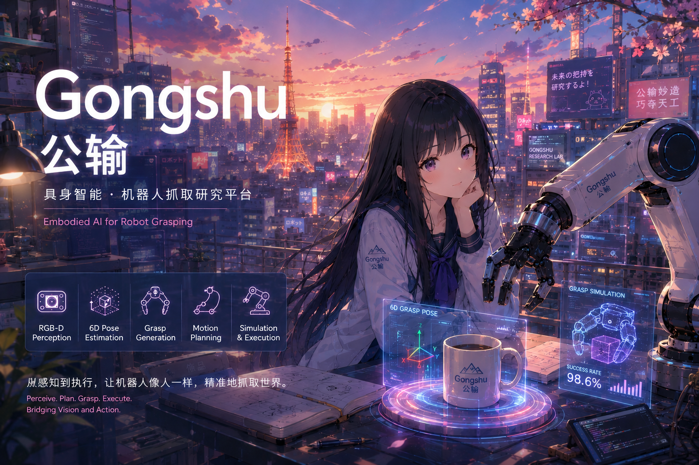
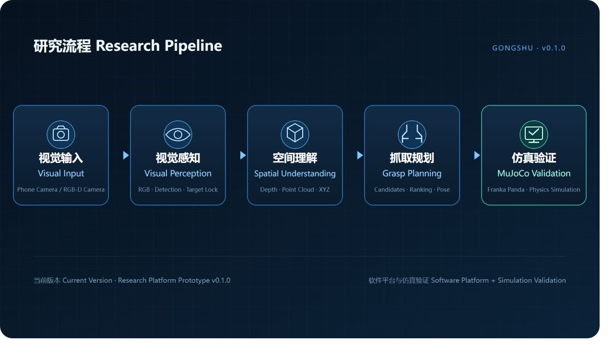
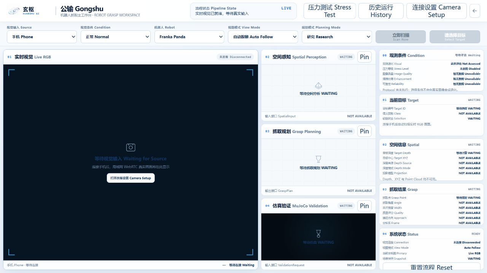

# Gongshu / 公输

<p align="center">
  <strong>Modular Robot Vision and Grasping Experimentation Platform</strong>
</p>

<p align="center">
  <a href="README.md">简体中文</a> ·
  <a href="README_EN.md">English</a> ·
  <a href="README_JA.md">日本語</a> ·
  <a href="README_KO.md">한국어</a>
</p>

<p align="center">
  <a href="https://github.com/PowellWells/gongshu/tree/v0.1.0"></a>
  <a href="#current-status"></a>
  <a href="pyproject.toml"></a>
  <a href="#requirements"></a>
  <a href="tests"></a>
  <a href="https://github.com/PowellWells/gongshu/stargazers"></a>
  <a href="https://github.com/PowellWells/gongshu/issues"></a>
  <a href="LICENSE"></a>
</p>

Gongshu is a modular experimentation platform for robot vision and grasping, connecting visual input, spatial understanding, grasp planning, and simulation validation.



> Project concept cover. The Current Status and Features sections define the actual scope of v0.1.0.

## Overview

Gongshu provides a traceable workflow for vision-driven robotic manipulation experiments, covering RGB input, compatible RGB-D data interfaces, target perception, depth and point-cloud processing, spatial understanding, grasp-candidate generation, and MuJoCo / robosuite validation. The workspace supports inspection of intermediate results, comparison of processing conditions, and reproducible run artifacts.

In v0.1.0, real visual input is provided by a phone camera on the same trusted LAN; RGB-D data is provided through simulation or compatible source interfaces. Franka Panda grasps are validated in MuJoCo / robosuite. This release does not include a validated end-to-end real-robot grasping system and does not present monocular depth or simulation results as physical-hardware measurements.

## Pipeline



```text
Phone Camera / RGB-D Camera
              ↓
      Visual Perception
              ↓
     Spatial Understanding
              ↓
       Grasp Planning
              ↓
      MuJoCo Validation
```

v0.1.0 implements Phone Camera RGB input and provides RGB-D processing interfaces for simulation and compatible data sources. Physical RGB-D Camera integration remains a future extension. Current monocular depth output is intended for research and simulation workflows and is not equivalent to calibrated metric measurements from an RGB-D sensor.

## Features

- **Desktop Research Workspace**: a four-view workspace for Live RGB, spatial perception, grasp planning, and MuJoCo validation.
- **Phone Camera RGB Input**: live RGB video and high-resolution capture from a phone over a trusted private LAN.
- **Camera Setup / QR Pairing**: local CA setup, short-lived pairing tokens, and QR-guided camera connection.
- **Real-time Visual Perception**: FastSAM instance regions, masks, bounding-box overlays, click-to-lock target selection, and lightweight tracking.
- **Spatial Perception Interface**: depth, point cloud, target XYZ, and camera-intrinsics status bound to one Scene Snapshot.
- **Grasp Planning Interface**: GR-ConvNet grasp maps, Top-K candidates, feasibility checks, and candidate ranking.
- **MuJoCo / robosuite Validation Interface**: Franka Panda dynamics simulation, result states, in-session recording, and replay.
- **Multi-condition Testing Interface**: explainable processing for Normal, Blur, Low-Light, and combined conditions, plus Research Mode stress tests.

## Demo

### Gongshu v0.1.0 Overview

<video src="https://github.com/user-attachments/assets/12a7abca-c202-45ff-b3dd-485dfb8e599a" controls width="100%">
</video>

The Gongshu v0.1.0 demo demonstrates the experimental workflow from visual input, target perception, spatial understanding, grasp planning, and MuJoCo-based validation.

The video file is also available in GitHub Release Assets for download: [Download the Gongshu v0.1.0 demo video](https://github.com/PowellWells/gongshu/releases/download/v0.1.0/gongshu-v0.1.0-demo.mp4).

### Project Screenshots



The screenshot shows the real Gongshu workspace at startup. After camera connection, Live RGB displays the video stream, target regions, and lock state; the other views update from the same target snapshot.

## Quick Start

### Requirements

- Windows 11 (currently validated platform)
- Python 3.12.x (`>=3.12,<3.13`)
- A phone and PC on the same trusted private LAN for Phone Camera input
- CUDA is optional; CPU fallback remains available

### Installation

```powershell
git clone https://github.com/PowellWells/gongshu.git
cd gongshu
py -3.12 -m venv .venv
.\.venv\Scripts\python.exe -m pip install --upgrade pip
.\.venv\Scripts\python.exe -m pip install -e .
```

`pyproject.toml` is the authoritative dependency source. `requirements.txt` is also provided for conventional environment setup:

```powershell
.\.venv\Scripts\python.exe -m pip install -r requirements.txt
```

Model weights are not distributed in the Git repository. FastSAM, Depth Anything V2, and GR-ConvNet follow the existing resolver order across a local Release Bundle, `artifacts/models/`, the user cache, and official sources. See [THIRD_PARTY_NOTICES.md](THIRD_PARTY_NOTICES.md) for source and license boundaries.

### Launch

Open Gongshu directly:

```text
Start-Vision2Grasp.cmd
```

Or enter through the XUANSHU LAB portal:

```text
Start-XUANSHU-LAB.cmd
```

PowerShell launch:

```powershell
.\.venv\Scripts\python.exe .\run_vision2grasp_app.py
```

The default workspace URL is `http://127.0.0.1:8765/apps/gongshu/index.html`. For the first phone connection, open **Camera Setup** in Gongshu and follow the local CA and pairing QR instructions.

## Project Structure

```text
gongshu/
├── assets/                     GitHub README assets
├── configs/                    Default experiment configuration
├── contracts/                  Run-result data contracts
├── frontend/                   Gongshu and XUANSHU LAB frontend
├── scripts/                    Launch, benchmark, and release scripts
├── src/vision2grasp/           Perception, spatial, grasp, control, and simulation modules
├── src/xuanshu_lab/            Desktop research-platform runtime
├── tests/                      Unit and integration tests
├── requirements.txt            Environment dependencies
├── VERSION.md                  Release version information
└── run_vision2grasp_app.py     Gongshu local-service entry point
```

Runtime models, certificates, camera sessions, user data, experiment outputs, and logs live in Git-ignored local directories and are not included in the source release.

## Validation

```powershell
.\.venv\Scripts\python.exe -m compileall -q .\src .\tests .\run_vision2grasp_app.py .\run_bottle_pipeline.py .\stage0_lift_smoke.py
.\.venv\Scripts\python.exe -m unittest discover -s .\tests -v
.\.venv\Scripts\python.exe -m pip check
node --check .\frontend\apps\gongshu\gongshu.js
node --check .\frontend\apps\gongshu\real-scene.js
node --check .\frontend\apps\gongshu\phone-camera\phone-camera.js
```

## Community

Reproducible bug reports, documentation improvements, and platform contributions within the project boundary are welcome. Read the [contribution guide](CONTRIBUTING.md) and [community code of conduct](CODE_OF_CONDUCT.md) before participating. Report security issues privately according to the [security policy](SECURITY.md).

## Current Status

**Current version: Open-Source Baseline v0.1.0**

v0.1.0 establishes the Apache-2.0 project license, open-source scope, and governance-freeze baseline while retaining the existing visual-input, spatial-understanding, grasp-planning, and simulation-validation capabilities. Physical-robot deployment remains future work; this release does not include a validated end-to-end real-robot capability.

## Future Extension

- RGB-D Camera
- Real Robot Integration
- 6D Grasp Research

## License and Third-Party Notice

Gongshu-owned source code is licensed under the [Apache License 2.0](LICENSE). Third-party code, models, assets, and runtimes retain their respective licenses and are not covered by the repository's Apache-2.0 declaration. Read [THIRD_PARTY_NOTICES.md](THIRD_PARTY_NOTICES.md) and [GONGSHU_SCOPE.md](GONGSHU_SCOPE.md) before use or redistribution.
